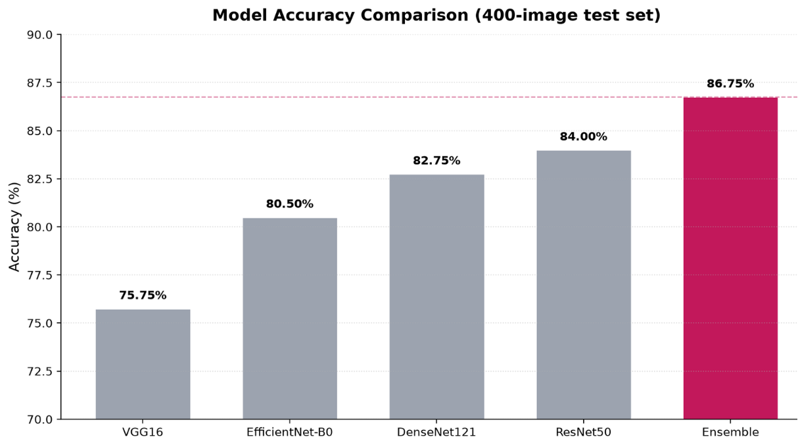
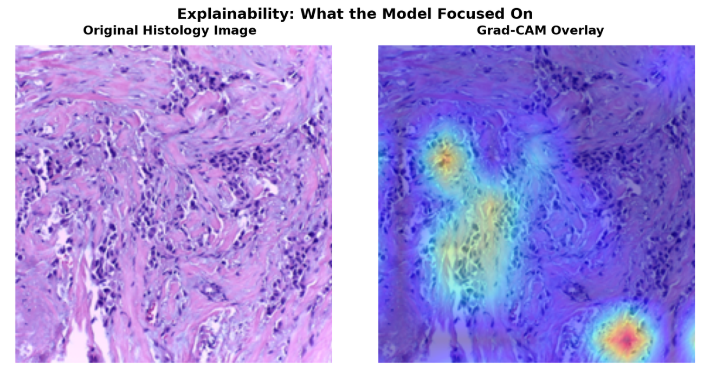
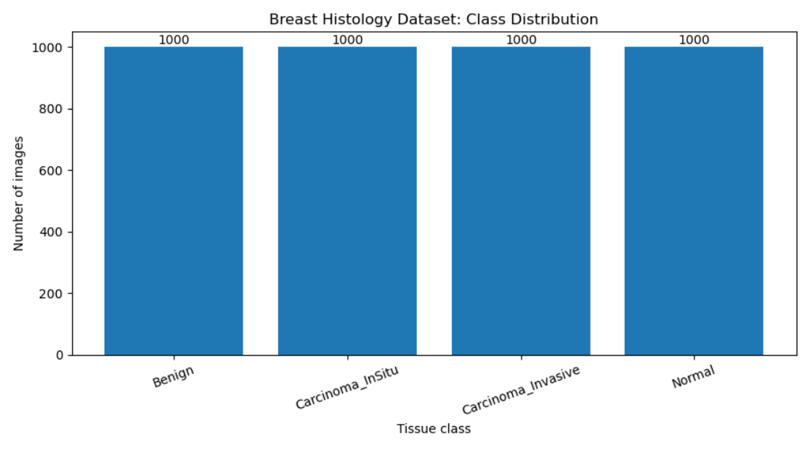

# Breast Cancer Detection

See what the model sees. Understand every prediction.. Upload a breast medical image, review the model's four-class prediction, and explore the regions that influenced its decision through Grad-CAM. This is an academic explainable-AI prototype for breast image analysis, with a FastAPI backend, React research interface, and the model is powered by CNNs, training, validation and testing sets and coded in the Python programming language. This ML project was built as the final team project for AI4ALL Ignite Summer Program.

## Problem Statement <!--- do not change this line -->

Breast cancer remains a leading cause of death among women, worsened by delayed diagnosis and limited healthcare access in low and middle income countries. Breast cancer survival exceeds 90% in high-income countries but drops to just 40% in South Africa (World Health Organization, 2025). Detected early, breast cancer has a 5-year survival rate of over 99%; once it spreads to distant organs, that rate falls to 31% (American Cancer Society, SEER Data, 2026). Breast cancer incidence among women under 50 is rising 1.4% per year, nearly double the rate in older women (American Cancer Society, 2024).

## Our Research Question
Can we accurately classify tissue as normal, benign, or a type of  malignant, while highlighting regions that influenced these decisions with a 90% certainty?

## Key Results <!--- do not change this line -->
The four-model ensemble was evaluated on a test set of **400 breast histopathology images** across four classes: Benign, Carcinoma In Situ, Invasive Carcinoma, and Normal.

### Overall Model Performance

| Metric | Score |
|---|---:|
| **Accuracy** | **86.75%** |
| Macro Precision | 87.13% |
| Macro Recall | 87.01% |
| Macro F1 | 86.66% |
| Weighted Precision | 87.38% |
| Weighted Recall | 86.75% |
| Weighted F1 | 86.62% |
| Test Samples | 400 |

### Per-Class Performance

| Class | Precision | Recall | F1 Score | Support |
|---|---:|---:|---:|---:|
| **Benign** | 93.62% | 76.52% | 84.21% | 115 |
| **Carcinoma In Situ** | 88.64% | 84.78% | 86.67% | 92 |
| **Invasive Carcinoma** | 83.87% | 88.64% | 86.19% | 88 |
| **Normal** | 82.40% | 98.10% | 89.57% | 105 |

 
<em>Combining four models raised accuracy from 75% to 86.75%, directly solving our single-model limitation.</em>

  

 
<em>The confusion matrix shows where our deployed ensemble still struggles, guiding where expert review matters most.</em>

### Key Findings

1. **Achieved 86.75% overall accuracy** across the 400-image test set using the four-model ensemble.
2. **Normal tissue achieved the highest recall at 98.10%**, meaning the ensemble correctly identified nearly all Normal samples in the test set.
3. **Benign tissue achieved the highest precision at 93.62%**, although its lower recall of 76.52% indicates that some Benign samples were classified as other classes.
4. **Normal tissue achieved the highest F1 score at 89.57%**, providing the strongest balance between precision and recall among the four classes.
5. **Macro precision, recall, and F1 remained near 87%**, indicating relatively consistent performance across the four tissue classes.

> **Note:** These results reflect evaluation on the repository's current 400-image test set and do not establish clinical effectiveness.

## Methodologies <!--- do not change this line -->

To accomplish this, we developed a full-stack application utilizing a React frontend, a FastAPI backend, and Supabase for secure authentication. For the machine learning pipeline, we utilized transfer learning on ImageNet-pretrained backbones to train four distinct Convolutional Neural Networks (ResNet50, DenseNet121, EfficientNet-B0, and VGG16) using an AdamW optimizer and CrossEntropyLoss. The histology image data was processed by resizing inputs to 224x224 and normalizing them, enabling us to classify tissue into four distinct classes while generating Grad-CAM heatmaps to visually explain the model's decision-making process.

| Hyperparameter | Value |
| :--- | :--- |
| Optimizer | AdamW |
| Learning Rate | 1e-4 |
| Batch Size | 16 |
| Epochs | 8 |
| Loss | CrossEntropyLoss |

 

* Engineered a soft-voting ensemble model combining four CNN architectures, which successfully elevated our classification accuracy from a 75% single-model baseline to 86.75%. When deployed to evaluate borderline or ambiguous cases, the integration of Grad-CAM heatmaps effectively transformed black-box algorithms into an explainable AI prototype, successfully highlighting the exact tissue regions that drove each diagnosis.

 
<em>Grad-CAM heatmaps reveal exactly which regions drove each prediction, turning a black box into an explainable result.</em>
  
 
<em>Our dataset is evenly balanced across all four classes, reducing bias toward any single diagnosis. 4,000 training images total.</em>

## Our App in Action <!--- do not change this line -->

### Landing Page & Overview
Explore our landing page and our mission along with model and team information.

### Secure Authentication
Login or create an account to access our Model Detection!.

### Ensemble Prediction System
Once authorized, you may apply the supported histology images into our 4-models-esembler system.

## Data Sources <!--- do not change this line -->

*Kaggle Datasets: https://www.kaggle.com/datasets/ucimachinelearning/breast-cancer-histology-images
 
<em>All Breast Histology image classes within the Kaggle dataset</em>
  
### Topic Research Citations <!--- do not change this line -->

1. American Cancer Society. [Breast Cancer Survival Rates](https://www.cancer.org/cancer/types/breast-cancer/understanding-a-breast-cancer-diagnosis/breast-cancer-survival-rates.html).
2. World Health Organization. [Breast Cancer Inequities / Global Breast Cancer Initiative](https://www.who.int/initiatives/global-breast-cancer-initiative/breast-cancer-inequities).
3. Lince-Deroche et al. / HEROZA (2019). [Costs of Breast Cancer Diagnostics in Johannesburg, South Africa](https://www.heroza.org/wp-content/uploads/2019/09/Lince-Deroche-et-al.-Costs-diagnostics-in-Joburg-RSA-working-paper-2019.....pdf).
4. *Deep learning empowered breast cancer diagnosis: Advancements in detection and classification*. PLoS One. 2024 Jul 11;19(7):e0304757. doi: 10.1371/journal.pone.0304757. PMID: 38990817; PMCID: PMC11239011.
5. National Breast Cancer Foundation. (n.d.). [Early detection of breast cancer](https://www.nationalbreastcancer.org/early-detection-of-breast-cancer/). 
6. Jiang, B., Bao, L., He, S., Chen, X., Jin, Z., & Ye, Y. (2024). [Deep learning applications in breast cancer histopathological imaging: diagnosis, treatment, and prognosis](https://doi.org/10.1186/s13058-024-01895-6). *Breast Cancer Research*, 26, 137. 
7. Cancer Research UK. (2026, February 13). [Why is early cancer diagnosis important?](https://www.cancerresearchuk.org/about-cancer/spot-cancer-early/why-is-early-diagnosis-important)
8. Ekpo, E. U., Alakhras, M., & Brennan, P. (2018). [Errors in mammography cannot be solved through technology alone](https://doi.org/10.22034/APJCP.2018.19.2.291). *Asian Pacific Journal of Cancer Prevention*, 19(2), 291–301.

## Technologies Used <!--- do not change this line -->
* **Frontend:** React
* **Backend:** FastAPI
* **Authentication & Services:** Supabase
* **Machine Learning Models:** ResNet50, DenseNet121, EfficientNet-B0, and VGG16 (combined into a soft-voting ensemble)
* **Explainable AI:** Grad-CAM heatmaps
* **Training Framework & Hyperparameters:** ImageNet-pretrained backbones with transfer learning, optimized using AdamW and CrossEntropyLoss

## Authors <!--- do not change this line -->
*This project was completed in collaboration with:*
  * **Amina Kudaibergen** – [GitHub](https://github.com/laximillion) | [LinkedIn](https://www.linkedin.com/in/amina-kudaibergen-689687226/)
  * **Allen Ramirez** – [GitHub](https://github.com/drizzyallen) | [LinkedIn](https://www.linkedin.com/in/allenram/)
  * **Cephas Osey-Bonsu** – [GitHub](https://github.com/CephasTechOrg) | [LinkedIn](https://www.linkedin.com/in/cephas-osei-bonsu-911731326/)
  * **Vamsi Chitturi** – [GitHub](https://github.com/vamsi-1111) | [LinkedIn](https://www.linkedin.com/in/vamsi-chitturi/)
